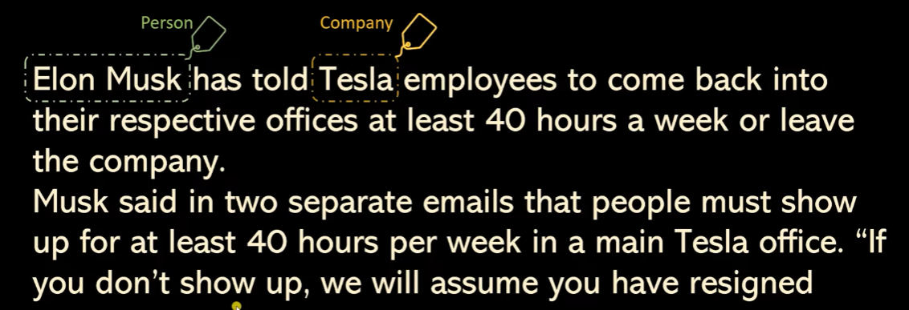
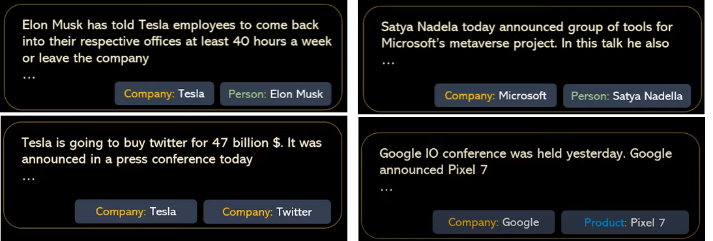
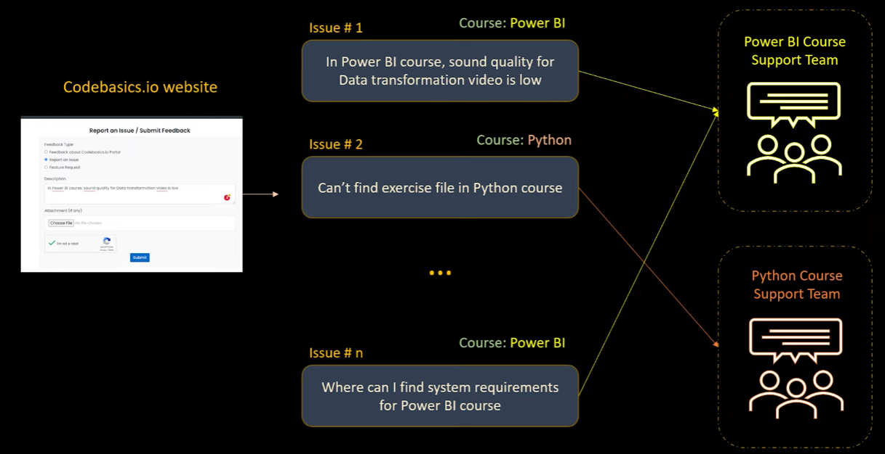
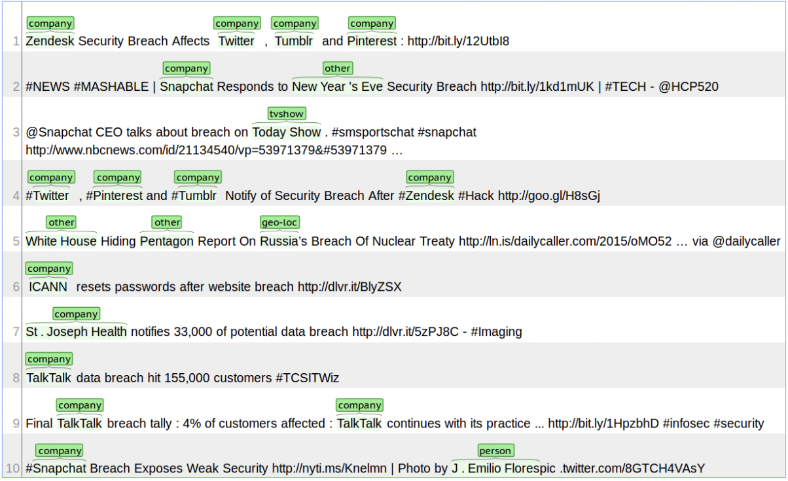
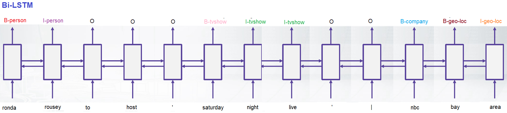

# NLP-Empowered-Named-Entity-Recognition
    EntitySense utilizes advanced NLP techniques to automatically identify and categorize entities in text data. With deep learning and semantic analysis, it offers accurate entity recognition, enabling applications like information extraction and sentiment analysis across different domains.

### What is NER?
* NER are basically Name entity recognition where you try to extact the different entities in you text. here we can extract person, place, company etc.
* It is very helpful in search the news related to certain person, place, company etc.
* for example, let say i have to search a news realted to tesla. i looks very straght forward that you put a key 'tesla' and search which news article contain the word tesla. but problem is that you don't know weather the article is talking about company name `tesla` or a person like `nocolus tesla`. that is why we need NER to find out the new article that is related to tasla company.

* here, there are different different entity available `Elon Musk` is person, `Tesla` is company, there could be location like `india`, `london`, money, `name of the drug` the entity could be anything.
* Use case #1: when we have lot of article you don't know what entity is mention, you can use NER system and it could extract all the entity.

* when you enter the name of company like `tesla` or name of product like `pixel` the it will extract all related article reated to that company and product. so this is very usefull in case of search.

* Use case #2: Recommendations, in the bloomberg news website, there is one section which is called `stories for you`, now this is the stories based on my preferences
* let's say i have read about article Elon Musk, Iphone and India. so from that article the entity will be `Elon Musk`, `Iphone` and `India` if i read this article then new time it will show me similar article with the similar entity, same like netflix recommandation.
* let's say you watch some documentry, and the entity could be who is production house of that movie, who is the actor of that movie and if my preference of watch movie of certain actor or production house then the recommendation system show me the movie based on that only.

* Use case #3: Customer Care service; let say you have a report issue on you edtech website, prople write there issue and forget there where it is facing the issue, is it on python, DSML, or Power BI, since differernt issue is handle by different team, if someone forget to mension where it is facing problem it will be difficult to route to the appropiate team, to solve this problem we used name entity to every issue.

## Problem Statement
Twitter is a microblogging and social networking service on which users post and interact with messages known as "tweets". Every second, on average, around 6,000 tweets are tweeted on Twitter, corresponding to over 350,000 tweets sent per minute, 500 million tweets per day.

Twitter wants to automatically tag and analyze tweets for better understanding of the trends and topics without being dependent on the hashtags that the users use. Many users do not use hashtags or sometimes use wrong or mis-spelled tags, so they want to completely remove this problem and create a system of recognizing important content of the tweets.

Named Entity Recognition (NER) is an important subtask of information extraction that seeks to locate and recognise named entities.

You need to train models that will be able to identify the various named entities.

## Data Description

Dataset is annotated with 10 fine-grained NER categories: person, geo-location, company, facility, product,music artist, movie, sports team, tv show and other. Dataset was extracted from tweets and is structured in CoNLL format., in English language. Containing in Text file format.

The CoNLL format is a text file with one word per line with sentences separated by an empty line. The first word in a line should be the word and the last word should be the label.

## Consider the two sentences below;

`sentence 1:` Harry Potter was a student living in london
1. Harry B-PER
1. Potter I-PER
1. was O
1. a O
1. student O
1. Living O
1. in O
1. London B-geo-loc

`sentence 2:` Albus Dumbledore went to the Disney World

1. Albus B-PER
1. Dumbledore I-PER
1. went O
1. to O
1. the O
1. Disney B-facility
1. World I-facility

These two sentences can be prepared in a CoNLL formatted text file as above.

Where B- and I- prefixes stand for the beginning and inside of the entity, while O stands for out of tag or no tag. 

## How to solve this problem: Named-Entity-Recognition (NER) on Twitter with Bi-directional LSTM
NER is a common task in NLP systems. Given a text document, a NER  system aims at extracting the entities (e.g., persons, organizations, locations, etc.) from the text.  Here, a BiLSTM (bi-directional long short term memory) will be used to recognize the named entities from Twitter texts.

## Bi-directional LSTM
provides a universal approach for sequence tagging
several layers can be stacked + linear layers can be added on top
is trained by cross-entropy loss coming from each position
